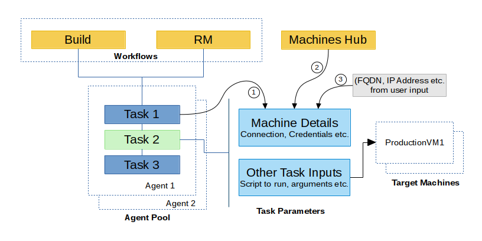
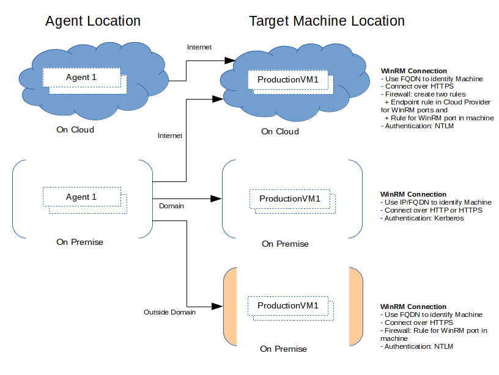

# Concepts
We will go over the various concepts related to deployments in VSTS in this
section.

VSTS Deployment system operates on the following high level concepts.

*Figure: Overview of concepts*

- **[Build], [RM]** are the workflow engines (RM is a short form for Release
  Management). They provide an ability to run a sequence of tasks on a machine
  choosen from a pool of machines. The pool is shown as **Agent Pool** in the
  diagram above.
- **[Task 1,2,3]** comprise the workflow sequence. Tasks are the actual units of work.
    + A task can run on the machine provided by the pool, or
    + A task can perform the work on another machine (may or may not be related to the pool)
- **[Task 2]** is a task of the second kind. Such tasks require additional
  information to connect to the **Target Machines** and do the work (run script,
  tool etc.). Let's call such tasks **remote tasks**.
- **Machine Details** are a necessary parameter for remote tasks. They provide
  connection information for the *ProductionVM1* like IP Address, Protocol,
  Credentials etc.. There are three sources to specify this information.
    + There are various ways to provide the Machine Details to a remote task
        (numbered 1, 2, 3 in the diagram). We will cover them in detail later.
- **Other Task Inputs** are user provided information to do the work on
  *ProductionVM1*. It could be a script or a command etc..

In a typical deployment scenario, Agent Pool will manage the worker or
controller machines. Machines in this pool will run all the tasks (like Build,
Test etc.). Only a few of those tasks will need to deploy the product or modify
a configuration on the target machines (we referred to such tasks as **remote
tasks** above). Target machines are the production machines where our product
gets deployed.

You may want to skip over to the [Getting Started]() page. Or stay with us, we
will explore the above concepts in more detail in the following sections.

## Workflows
At the core, workflows provide the ability to describe a sequence of
Tasks to be run against a pool of machines. On top of that, they provide
security around who can queue a workflow, details of logging and diagnostics
around the various tasks, the results etc.. The workflow engine takes a good
number of decisions based on these capabilities (like failure alerts, automated
rollbacks, or deployments to multiple environments).

Workflows are the basis of a Continuous Integration (CI) or a Continuous
Delivery/Deployment (CD) pipeline. In VSTS, Build provides the ability to implement a
CI pipeline on top of various source control systems, and Release Management
(RM) provides the ability to create a CD pipeline.

You can read more about Build here, and RM documentation is here.

## Machines
As we saw above, there are two concepts related to Machines: (a) Agent Pool, (b)
Target Machines.

**Agent Pool** comprises of non-production worker machines, where CI/CD
activities run (incl. enlisting to source code, running tests, etc..). Machines
are allocated to a Agent Pool when they run the VSTS automation agent. You can
read more about agent pools in the official documentation [about configuring
agents](https://msdn.microsoft.com/en-us/Library/vs/alm/Release/getting-started/configure-agents).

**Target Machines** consists of the Production/Test Machines on which product is
deployed. They don't run any agent. However they need to be configured to enable
the automation agents (in the Agent Pool) to push and execute scripts or
commands. We will talk more about this in a moment.

The Workflow uses Target Machines in two possible steps:

- **Provision**: in the provision step the Machines in Target Machines group are
  allocated. E.g. creating a new resource group in Azure with 10 virtual
  machines. We've a task for that, see [DeployAzureResourceGroup][].
- **Deployment**: in such a step a script/command is executed on the provisioned
  machine. It could also transfer a set of data to the Target Machines. This
  step requires a provisioned machine with an open communication channel. E.g.
  [PowerShellOnTargetMachines][] is a Deployment task, on a machine with an open
  winrm port, it can run a given powershell script.

In a workflow, the **Provision** step is optional. We may already have physical
machines (ready with a OS) on premise. In that case, the **Deployment** step can
just use the connection information for these machines to deploy bits.

The figure below shows how machine input fields for the **remote tasks** looks.

*Figure: Target Machines input for a Remote Task*

We cover more details in [Specify Target Machines](/target-machines) section.

## Connection
Remote tasks use WinRM as the connection channel. A connection channel must
be configured on the machines before the remote task is used. Before we go
further, let's revisit the various possible cases for connections:

*Figure: Overview of connection types between Agent and Target Machines*

Notes:

* WinRM supports Kerberos and NTLM as authentication mechanisms. Kerberos is
  used when the machines are domain joined and an active directory user
  credentials are used, NTLM is used in all other cases.
* WinRM supports both HTTP and HTTPS protocols for exchanging messages between
  the local and remote machines. In this guide, we will concentrate primarily on
  using HTTPS protocol.

We will start with the case of configuring WinRM connection on a local machine
and then move onto the configuration in case of a new machine (dynamic
provisioning).

## Service endpoints
TODO - provide a brief overview

https://msdn.microsoft.com/Library/vs/alm/Release/author-release-definition/understanding-tasks#Serviceendpoints

## Tasks variables
TODO - provide a brief overview

https://msdn.microsoft.com/Library/vs/alm/Release/author-release-definition/understanding-tasks#Pre_definedvariables

[DeployAzureResourceGroup]: https://github.com/Microsoft/vso-agent-tasks/tree/master/Tasks/DeployAzureResourceGroup
[PowerShellOnTargetMachines]: https://github.com/Microsoft/vso-agent-tasks/tree/master/Tasks/PowerShellOnTargetMachines
[Variables]: xxx
[Connection]: xxx
[SecretsOfPowershellRemoting]: https://www.penflip.com/powershellorg/secrets-of-powershell-remoting/blob/master/remoting-basics.txt
