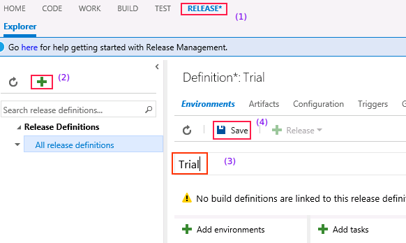
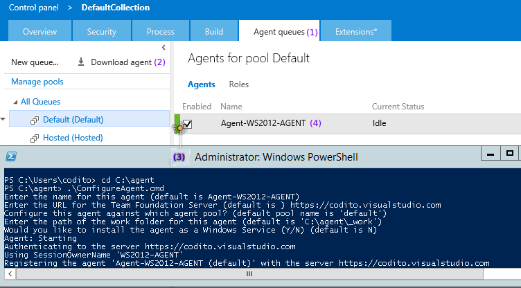
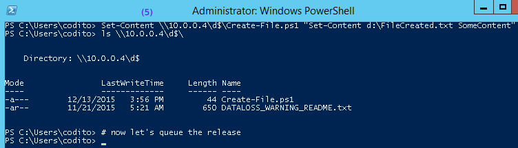
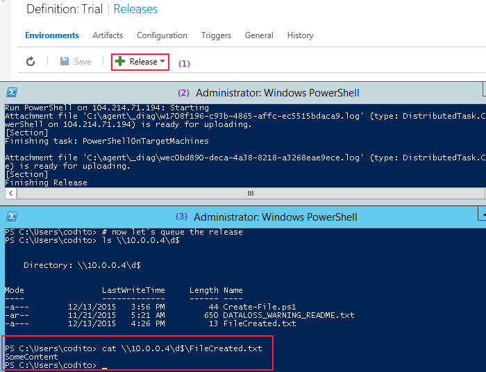

# Welcome!

This guide will help you get started with setting up a delivery pipeline on
Visual Studio Team Services account. In the **Getting Started** section below,
we're going to start with a simple scenario: run a *Hello World* script on a set
of virtual machines.

Later in this guide, we will walk through some deployment related [concepts][],
then [specify][target-machines] the deployment machines,
[configure][configure-connections] them and so on. Feel free to explore around.

If you've been here earlier, you may check out the [changelog][] to check new
additions.

This guide is a product of the community. You can [contribute][] too! We gladly
accept any improvements and ideas :)

---

## Getting started
We'll assume you already have a VSTS account. You can get yourself one
[here](https://app.vssps.visualstudio.com/profile/account?account=true).

### Setup a release definition
Navigate to `https://youraccount.visualstudio.com/`.

*Figure: Create a release definition*

**Steps to create a release definition:**

1. Navigate to the Release Hub in your VSTS account
2. Click on the **+** button
3. Provide a name for the Release Definition. In the figure, we name it as
   *Trial*
4. Save the definition

### Configure a local agent

*Figure: Linking an agent queue for the Release Definition*

**Steps to link an agent:**

1. Click on the options for the Environment *Default Environment*
2. We will set *Skip artifacts download* for this example. This will allow us to
   run a release without linking it to a Build Definition
3. We've configured the Release Definition to pick up any available agent from
   **Default** queue. *Manage Queues* allows to setup a agent to run the release
   definition

Click on *Manage Queues* to move to the page shown below. Let's download and configure the agent now.

*Figure: Configure an Agent for the Default queue*

**Steps to configure an Agent:**

1. Navigate to Agent Queues settings in Collection configuration (step 3 above
   will open this page in a new browser window) 
2. Download the agent zip file to local machine
3. We run the commands to configure an agent

[MSDN](https://msdn.microsoft.com/en-us/Library/vs/alm/Release/getting-started/configure-agents) covers this topic is great detail.

### Add a remote powershell task

*Figure: Add the remote powershell task*

**Steps to add the Remote Powershell task:**

1. Click on *Add Tasks* to bring up the available Tasks
2. Filter the tasks with *Deploy* category. Click on *Add* to add the remote
   powershell task to release definition

### Specify Target machines, connection parameters

*Figure: Setup target machines and winrm configuration in remote powershell task*

**Steps to configure Remote Powershell task:**

1. Use the IP address of remote machine (in this example, the machine is in a
   local network)
2. Provide administrator username for *10.0.0.4*
3. Provide the administrator password for *10.0.0.4*
4. Choose *HTTP* protocol, we assume that the machine is configured for WinRM
   over HTTP in this example
5. Instruct the task to run `D:\Create-File.ps1` in the remote machine

We cover the Step 1 in much more detail in [Specify Target
Machines](/target-machines) section. WinRM configuration is covered in
[Configure Connections](/configure-connections) section of this guide.

Now let's create the file `Create-File.ps1` in the machine *10.0.0.4*. We run
these commands in the Agent machine, since *10.0.0.4* is on the local network,
we just use windows file sharing to create the file.

*Figure: Create the remote script*

### Queue a release

At this point, we're all set to queue a release.

*Figure: Queue a release*

**Steps to queue a release:**

1. Click on the *Release* menu to create a new release
2. Observe the release is immediately picked up by the Agent
3. Wait for the release to complete. Check that the machine *10.0.0.4* now has a
   new file created `D:\FileCreated.txt`

## Where Next?

Congrats on creating your first Deployment workflow! Move onto the [concepts][]
section to learn more.

[concepts]: /concepts
[target-machines]: /target-machines
[configure-connections]: /configure-connections
[contribute]: /contribute
[changelog]: #changelog
