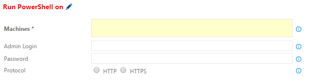
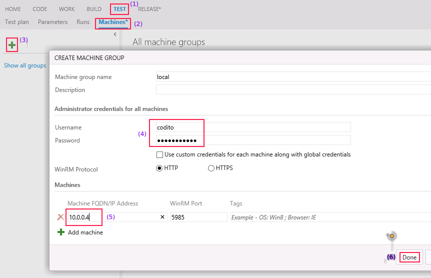

# Overview
In the concepts section, we have covered the various ways to specify a set of
Target Machines for deployment. You can provide the set of target machines in an
input form in the Task as shown below:

*Figure: Target Machines input for a Remote Task*

Let's explore each of the input specifications in more details.

---

## Using Flat List
This is the easiest way to specify a set of machines for a remote task. Just
provide the list of machines as a comma separated string.

| Valid                              | Machine List Input                    | Remarks            |
|------------------------------------|---------------------------------------|--------------------|
| ✓ | 127.0.0.1:90,map.cloudapp.net,8.8.7.6 |                    |
| ✓ | map, zap, microsoft.com               |                    |
| ✗   | 127.0:90, 90,                         | Invalid IP address |
| ✗   | 127.0.0.1:90; foohost                 | Invalid delimiter  |

*Table: Inputs for the Machines field of a remote task*

It is possible to provide a port for the Machine along with IP Address or FQDN
(Fully Qualified Domain Name). If the port is provided, it is used along with
protocol; else the tasks choose a default port based on protocol.

| Protocol | Port                            |
|----------|---------------------------------|
| HTTP     | User provided or 5985 (default) |
| HTTPS    | User provided or 5986 (default) |

*Table: Protocol and Ports for WinRM connection*

E.g. in the first example, port `90` is used for `127.0.0.1` irrespective for
the chosen protocol; for `8.8.7.6` port `5985` is used if `HTTP` protocol is
chosen else port `5986` is chosen for `HTTPS`.

The provided credentials (`Admin Login`, `Password`) is used for WinRM
connection to all the machines.

## Using Output Variables
Output Variables build on the concept of Variables. The idea is really simple:
one task in the Workflow sequence creates a list of machines, other subsequent
tasks in the workflow can use the created list.

E.g. [DeployAzureResourceGroup][] task provides a Output field (`Resource
Group`) to define an output variable, the same string can be provided as an
input to [PowerShellOnTargetMachines][] task.

| Valid                              | Machine List Input      | Remarks        |
|------------------------------------|-------------------------|----------------|
| ✓ | $(MyAzureResourceGroup) |                |
| ✗   | (MyAzureResourceGroup)  | Invalid syntax |
| ✗   | MyAzureResourceGroup    | Invalid syntax |

*Table: Inputs for the Machines field of a remote task*

### Notes
* Output Variables are expanded by the Workflow before the remote task is
  executed, just like the normal [Variables][].
* If two Provision tasks produce the same Output variable, the later variable
  overwrites the earlier.

## Using Machines Hub
Machines Hub provides a simple way to add existing machines. It is accessible
for your account with this url:
`https://youraccount.visualstudio.com/DefaultCollection/yourProject/_machines`.

### Add a set of machines

*Figure: Adding a list of machines in Machine Hub*

1. Navigate to the **Test** hub
2. Navigate to the **Machines** hub under Test
3. Click **+** to show the **Create a new Machine Group** dialog
4. Provide any name for the Machine Group. Provide the username/password (this applies to all machines in the group)
5. Provide FQDN or IP address/port information for the machines
6. Click **Done** to save the Machine Group

As with previous approaches, added machines must have the WinRM connection
configured. We cover the various details of setting up WinRM in [Connection][]
section.

### Using Machine Group in a task
You can use the Machine Group name provided above for the **Machines** field in
the remote tasks.

## Precedence Order of Approaches
The astute reader may have noticed, a provided string in the **Machines** field
could match an output variable and a Machine Group at the same time.

Following order is used for evaluation of **Machines**:
1. Flat machines
2. Output variables
3. Machine Group

For the scenario above, if the same Machine Group exists as an Output variable,
it will never be used. Please use a different name for Output variable and
Machine Group.

## Comparison of Approaches
We've looked at three ways to specify machines for a remote task. Let's quickly
compare various aspects of these:

| Aspect                   | Flat list | Output variables | Machines Hub |
|--------------------------|-----------|------------------|--------------|
| Secure                   | ✓         | ✓                | ✗            |
| Reuse (same Workflow)    | ✓         | ✓                | ✓            |
| Reuse (across Workflows) | ✗         | ✗                | ✓            |
| No additional step       | ✓         | ✗                | ✓            |

### Notes on Aspects: Security

- **Machines Hub** details are accessible to everyone in a Project. It means
  anyone who is a contributor can use the credentials to connect to Machine. It
  is not recommended for Production Machines where the machine details are a
  secret.
-  **Output variables** and **Flat list** are scoped to a Build or Release
  Definition, hence they are guarded by the security permissions to Edit the
  Build/Release definition. 

### Notes on Aspects: Reusability

- **Flat list** doesn't support using the same machine lists in several tasks in
  a Workflow in a direct way. However we can use Variables to declare them once
  and use the variable to substitute machines across tasks.
- **Flat list** and **Output variables** are concepts with the lifetime same as
  a workflow. They are not accessible across Workflows. This aspect can be seen
  as a strength and a weakness. YMMV.

### Notes on Aspects: Additional step
**Output variables** requires a Provision task to define the output variable
which can be used later in the tasks within the Workflow sequence.

## Filtering Machines
There are two ways to filter TODO::

[DeployAzureResourceGroup]: https://github.com/Microsoft/vso-agent-tasks/tree/master/Tasks/DeployAzureResourceGroup
[PowerShellOnTargetMachines]: https://github.com/Microsoft/vso-agent-tasks/tree/master/Tasks/PowerShellOnTargetMachines
[Variables]: xxx
[Connection]: xxx
[SecretsOfPowershellRemoting]: https://www.penflip.com/powershellorg/secrets-of-powershell-remoting/blob/master/remoting-basics.txt
